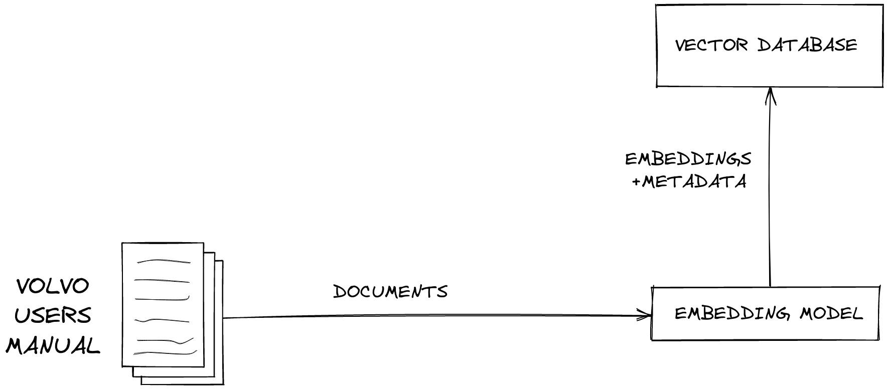
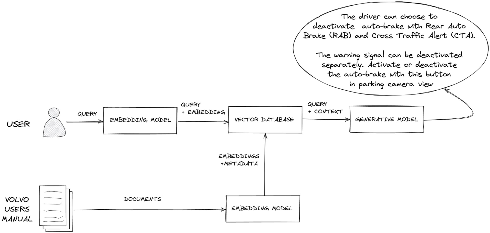

## Q&A Based AI Model with Retrieval Augmented Generation (RAG)

### Overview

A Q&A based answering system with retrieval augmented generation to ensure relevant data is present in the AI response.

We implement a vector database and connect it to an embedding model and a language model to create a RAG application.

Vector Databases are commonly used in RAG systems to produce responses that are grounded in some data.

Here, we implement:
1. `In-Memory Vector Database`
1. `End-to-End RAG system using Hugging Face Transformers`


Models:
1. `Embedding Model: TaylorAI/bge-micro` [docs](https://huggingface.co/TaylorAI/bge-micro)
1. `Text Generation: OpenAI/gpt-4o` [docs](https://platform.openai.com/docs/guides/text-generation)

### Requirements

#### VectorDB
```
1. Insert elements
2. Search and return the `top-k` closest elements

NOTE: Mock Data is available at blog.json
```


#### Distance Metrics (for similarity search)
```
1. cosine similarity
2. dot product
3. euclidean distance
```

#### Workflow

```
1. Initialize the database with the data from blog.json
2. Take a user's query
3. Retrieve the top-k relevant documents for that query based on the vector similarity choice
4. Generate a RAG response leveraging a LLM
```

#### Executing the AI Pipeline

```
1. pip install -r requirements.txt
2. python tools/test.py: Specify the documents path, user query, top-k relevant documents, and the similarity search model.
```

#### To-Do:

```
1. Batch Insert and Queries: To ensure the insert and search functions support inserting multiple entries in one call and searching for multiple results with one call - to improve the throughput and reduce the overhead.
2. Persisting the encoding - to ensure we don't re-encode and ensure that the data persists between different sessions such that we don't ingest all out data in the event of database failure.
3. Multiple Indexes.
```

| VectorDB Overview |
|--------------------------------------------|
|      |

| RAG Overview |
|--------------------------------------------|
|      |
| Image Source: https://www.pinecone.io/learn/retrieval-augmented-generation/                  |

#### Tree Structure

```
├── README.md
├── requirements.txt
├── data
│   ├── blog.json
│   ├── blog_and_comments.json
│   └── comments.json
├── imgs
│   ├── RAG.jpeg
│   └── VectorDB.jpeg
├── library
│   ├── __init__.py
│   └── src
└── tools
    ├── __init__.py
    └── test.py
```